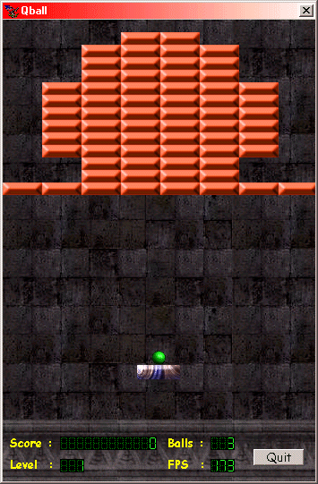



## Qball

### Description

Qball its like a breakoutgame. (see screen shot)

It is using directx 7 or higer for the sound.

Bitblt for texture.

Normal mode is 200 fps (i know its not normal you need a fast pc)

I made 3d sound(suround) vvvery cool if you have a card that suports it.

I olso made a directmusic port for the background.

It has a nice option (it detect devices like : soundcard, videocard)

It has a scortcut by right clicking on a level file you can press play or edit(if you have the level editor)

It has an idea how to change keys from function in your game.

It has a lot of bonus thing like, ExtraBall(max 20), BallCannon, LargeShip, VeryFast(works only if you have quick pc), Stickball, ExtraLive

Some thing to know :

The soundcard driver combo (in option) is most of the times on the wrong value.

So frist goto option and use test to test the sound

Cheats :

always before typing a cheat press the delete key

gun : ballcannon

sticky : stickyball

fast = hyperspeed

large = largeship

monsterballs = THIS ONE IS A COOL CHEAT

i think there are some more see the source code and find out!

I hope you going to enjoy playing the game. ;-)

btw : there is olso a level editor on pcs for this game see my other submitions
 
### More Info
 

             |
---                |---
**Submitted On**   |2001-01-31 12:56:10
**By**             |[egbert](https://github.com/Planet-Source-Code/PSCIndex/blob/master/ByAuthor/egbert.md)
**Level**          |Intermediate
**User Rating**    |4.5 (58 globes from 13 users)
**Compatibility**  |VB 5\.0, VB 6\.0
**Category**       |[Games](https://github.com/Planet-Source-Code/PSCIndex/blob/master/ByCategory/games__1-38.md)
**World**          |[Visual Basic](https://github.com/Planet-Source-Code/PSCIndex/blob/master/ByWorld/visual-basic.md)
**Archive File**   |[CODE\_UPLOAD143621312001\.zip](https://github.com/Planet-Source-Code/egbert-qball__1-14866/archive/master.zip)

